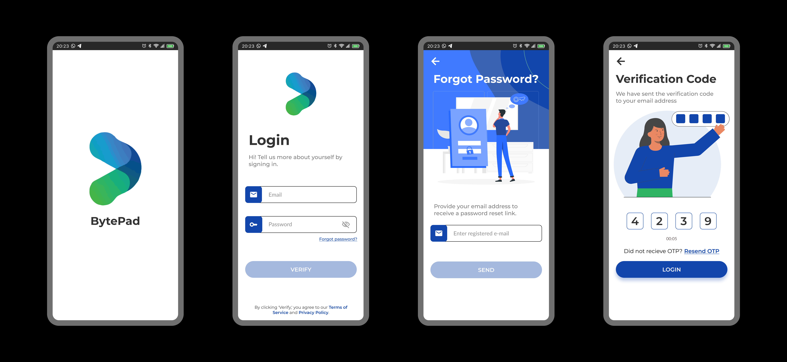
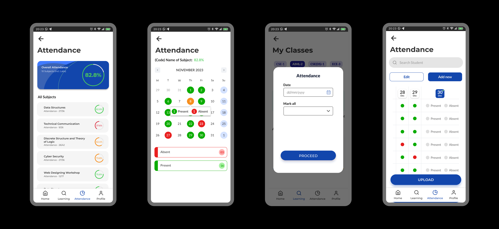
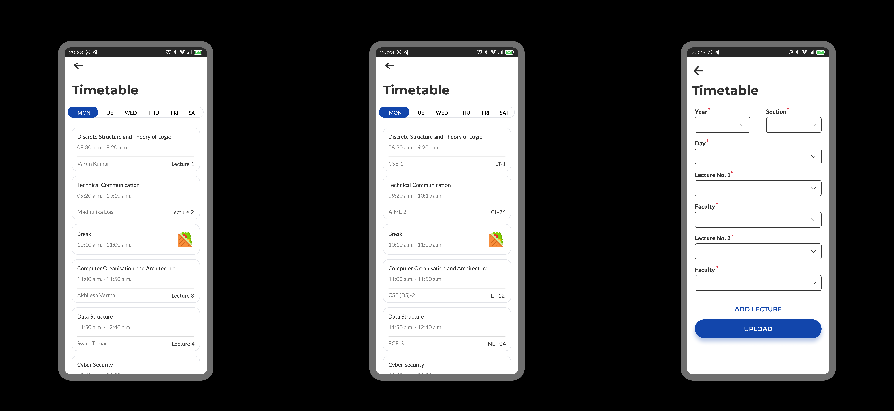
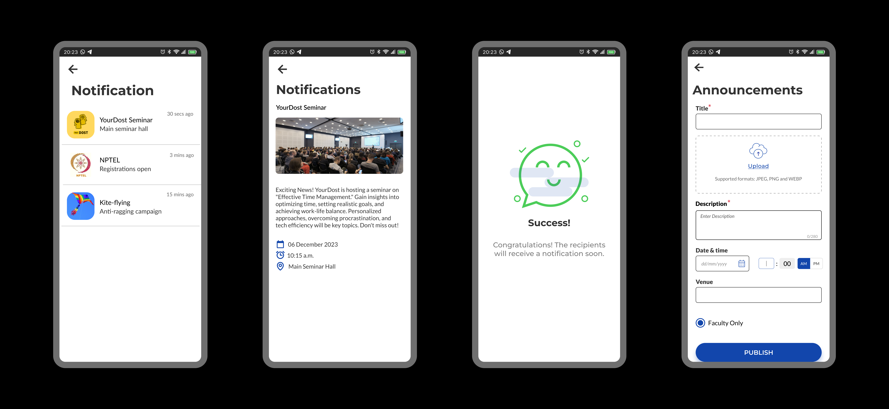
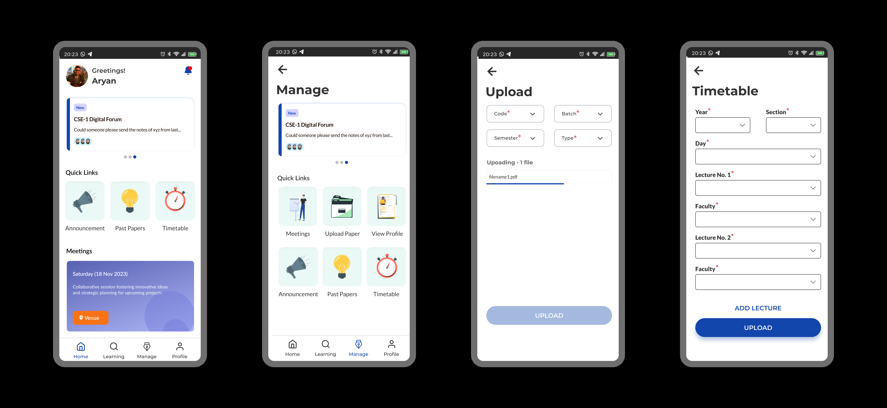

# BytePad - Student Management App

BytePad is a comprehensive student management app designed to streamline and enhance the academic experience for students, teachers, and Heads of Department (HOD). This app offers a range of functionalities to facilitate seamless communication, resource access, and organization. Whether you're a student, teacher, or HOD, BytePad has you covered. 🚀

## Screenshot

## Features

### 1. Past Papers and Solutions 📚

Access a repository of past papers and their solutions to help students prepare for exams effectively. Teachers can contribute to the repository, ensuring a comprehensive collection of study materials.

### 2. Attendance 📅

Keep track of attendance effortlessly. Students can view their attendance records, while teachers can easily mark and manage attendance for their classes.

### 3. Timetable ⌚

Stay organized with a dynamic timetable that adapts to your schedule. Students and teachers can view their timetables, helping them plan their activities efficiently.

### 4. Announcement 🔔

Receive important announcements from teachers or HOD directly through the app. Stay informed about class updates, schedule changes, and other essential information.

## User Roles

### 1. Students 👩🎓👨🎓

- View attendance records
- Access past papers and solutions
- View assignments
- View and manage timetable
- Get notified about events
- Receive announcements

### 2. Teachers 👩🏫👨🏫

- Mark and manage attendance
- Contribute to the past papers repository
- Upload solutions of past papers
- View and manage timetable

### 3. Heads of Department (HOD) 👩💼👨💼

- Monitor overall attendance trends
- Oversee and contribute to the past papers repository
- View and manage departmental timetable
- Broadcast important announcements to the department
- Create timetables

## Frontend

The frontend for this application is developed by Lakshya Goel ([lakshya1goel](https://github.com/lakshya1goel)). You can find the frontend repository at [BytePad](https://github.com/lakshya1goel/BytePad/).

## Installation

To run Bytepad locally, follow these steps:

1. Clone the repository: `git clone https://github.com/Yash114Bansal/Bytepad/`
2. Install dependencies: `pip install -r requirements.txt`
3. Set the following environment variables:

- `SECRET_KEY`: Django secret key for security.
- `DATABASE`: Connection URL for your PostgreSQL database.
- `CLOUDINARY_URL`: URL for Cloudinary integration.
- `CLOUD_NAME`: Cloudinary cloud name.
- `API_KEY`: Cloudinary API key.
- `API_SECRET`: Cloudinary API secret.
- `EMAIL_HOST_USER`: Email host username for sending emails.
- `EMAIL_HOST_PASSWORD`: Email host password.

4. Set up the database: `python manage.py migrate`
5. Run the development server: `python manage.py runserver`

## Usage

1. **Installation:** Download and install BytePad Mobile Application.

2. **Account Creation:** Students, teachers, and HOD can login using their official credentials provided by the institution.

3. **Explore and Engage:** Explore the various features and start using BytePad to enhance your academic experience.

## Contributing

Contributions to Bytepad are welcome! If you encounter any issues or have suggestions for improvements, please feel free to open an issue or submit a pull request.
